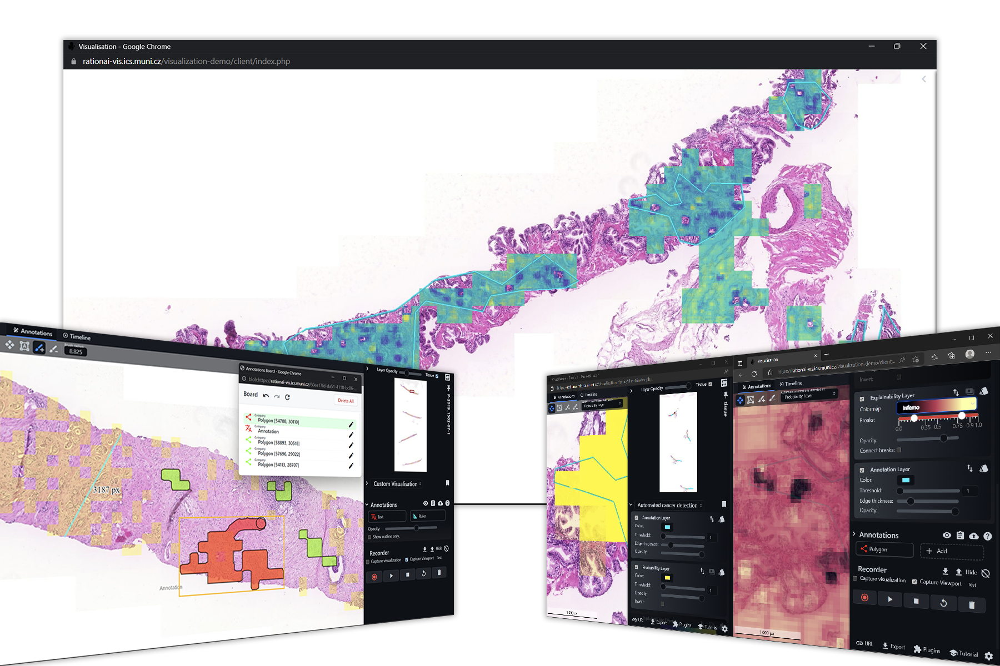

<h1 align="center">XOpat - Explainable Open Pathology Analysis Tool
</h1>

  A web based, REST API oriented WSI Viewer with enhanced rendering of high resolution images overlaid, fully modular and customizable.

With the focus on flexibility, extensibility and modularity, the xOpat
viewer tries to address various issues in digital pathology related to analysis and 
AI development.

Annotations, and other plugins introduce a powerful set of additional features
that take the WSI far beyond standard.

Note that the viewer is still in active development. Currently, it is used for versatile
offline AI data inspection. We work now on integration workflows and in future
the focus will be on services, namely non-standard integration with a ML pipeline for
effective algorithm/network debugging and profiling with the help of powerful visualisation platform. 

## Setup
There is _docker_ available: https://github.com/RationAI/xopat-docker. Although very versatile, setting up
the viewer correctly requires web development knowledge. The docker system is standalone ready to use environment.
Each Dockerfile also shows how to configure a component so that the system (the viewer, browser and image server) work together - it is a great example on how to configure 
your servers properly.

## Environment, Build & Test

The visualization itself is not based on any framework, it is pure JavaScript application that integrates
various libraries. That is true for the running deployed application. However, testing and building uses ``npm``, `grunt` and `cypress`.

> The build and test framework is still in development - for now, the viewer can be used AS-IS just add the OSD library and run from a PHP server.

For more details, see ``test/``.

For details on integration, see ``INTEGRATION.md``.
