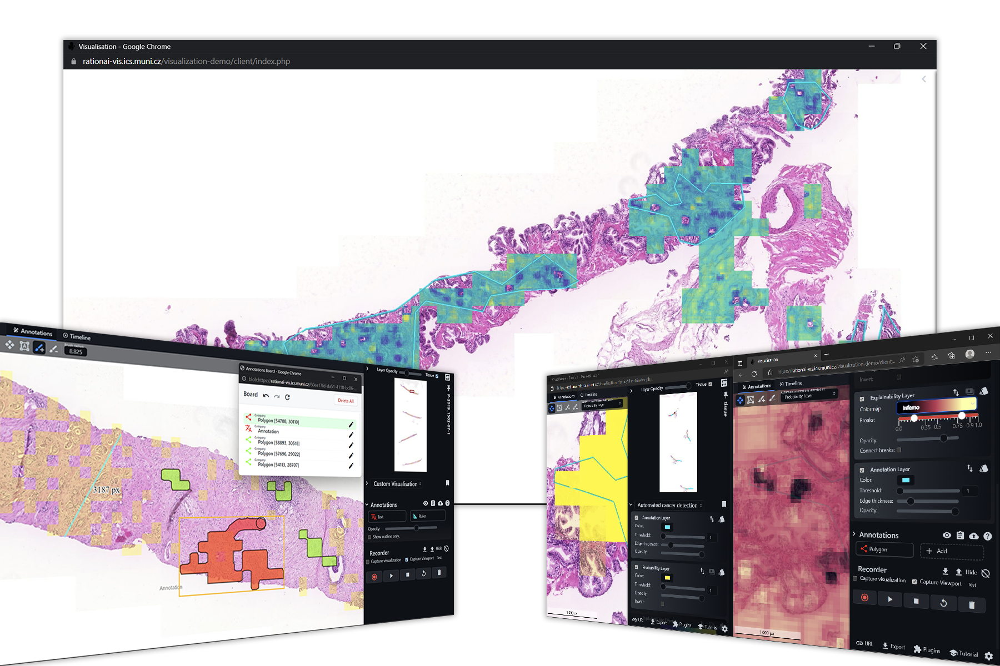

<h1 align="center">XOpat - Explainable Open Pathology Analysis Tool
</h1>

  A web based, NO-API oriented WSI Viewer with enhanced rendering of high resolution images overlaid, fully modular and customizable.

### Why xOpat?

Configure the viewer to your needs, not vice versa! Here, you can take a half-ready solution
and bring it to something that covers all your needs. With the focus on flexibility, extensibility and modularity, the xOpat
viewer tries to address issues in digital pathology related to analysis and 
AI development.

### Behaves as an enhanced OpenSeadragon*, a popular (feature-less) flexible viewer.
<ul>
:floppy_disk: Full data & API protocol flexibility. No backend services are hardcoded. 
:bar_chart: Powerful visualization capabilities, similar to Photoshop layers. 
:gear: Configurability: static & runtime. 
:package: Annotations, and other plugins introduce an unusual set of additional features
     that take the WSI far beyond standard.
</ul>

### Powerful set of modules and plugins: Advanced extensibility & Existing features
<ul>
:key: OIDC Authentication 
:book: Visualization Storytelling 
:memo: Versatile annotations and supported annotation formats. 
:bulb: Flexible tutorial system: send viewer session with custom tutorials! 
:bookmark_tabs: EMPAIA Integration 
:keyboard: Screenshot or viewport copy/paste shortcuts 
... 
:fast_forward: And more including anything you add! 
</ul>

### Servers
To parse existing modules, plugins, read POST data the viewer uses a server. Don't worry,
we try to cover it all!
<ul>
:heavy_check_mark: PHP Server 
:heavy_check_mark: Node.js Server 
:heavy_check_mark: Server-less: compiled once, used statically! 
</ul>

Note that the viewer is still in active development. If you wish to start
using the viewer, please do not hesitate to reach us. Currently, it is used for versatile
offline AI data inspection. We work now on integration workflows and in future
the focus will be on services, namely non-standard integration with an ML pipeline for
effective algorithm/network debugging and profiling with the help of powerful visualization platform.

## Setup
First, install development dependencies. You need ``node`` and `npm`. Then just run `npm install`.

Although very versatile, setting up the viewer correctly requires xOpat configuration & web development knowledge.
To configure the viewer for deployment, run ``grunt env`` and provide `env/env.json` file with the desired configuration.
For more, see ``env/README.md``.

> PHP server has available _docker image_. Node server can be run e.g. locally via ``npm run node``.
> However, to really open the viewer with a meaningful data and visualization, you need to provide the data,
> configure a WSI server and open the viewer session. To simplify all of this, we work on example deployment docker
> compose we will soon publish.

## Environment, Build & Test

xOpat itself is not based on any framework, it is pure JavaScript application that integrates
various libraries. That is true for the running deployed application. 
However, testing and documentation uses ``npm``, `grunt` and `cypress`.

> The build and test framework is still in development - for now, the viewer can be used AS-IS just add the OSD library and run from a PHP server.

To minify (build) the viewer, you can run

> grunt all

and for plugins only

> grunt plugins

or modules only

> grunt modules

This will create ``index.min.js`` files in respective directories. The viewer core recognizes
existence of these files and loads them instead of all the source scripts.

For more details on components, see README files in respective directories.
For details on integration, see ``INTEGRATION.md``.
For documentation, you can run ``npm install && grunt docs && grunt connect watch``
and open ``localhost:9000/``
