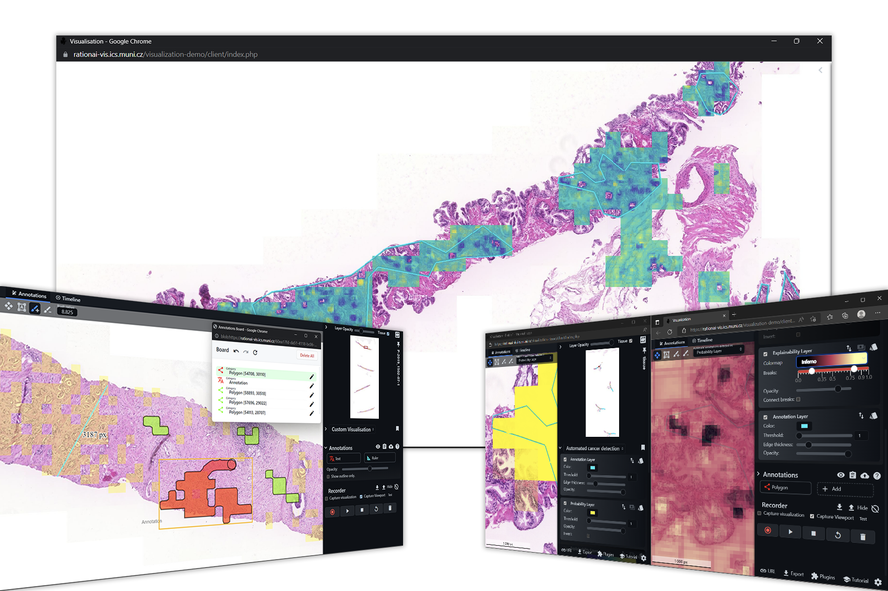

<h1 align="center">XOpat - Explainable Open Pathology Analysis Tool
</h1>

  A web based, NO-API oriented WSI Viewer with enhanced rendering of high resolution images overlaid, fully modular and customizable.

## :point_right: Why xOpat?

Configure the viewer to your needs, not vice versa! Here, you can take a half-ready solution
and bring it to something that covers all your needs. With the focus on flexibility, extensibility and modularity, the xOpat
viewer tries to address issues in digital pathology related to AI adoption.

### Behaves as an enhanced OpenSeadragon*, a popular (feature-less) flexible viewer.
:floppy_disk: Full data & API protocol flexibility. No backend services are hardcoded.  
:bar_chart: Powerful visualization capabilities, similar to Photoshop layers.  
:gear: Configurability: static & runtime.  
:package: Annotations, and other plugins introduce an unusual set of additional features that take the WSI far beyond standard.  

### Powerful set of modules and plugins: Advanced extensibility & Existing features
:key: OIDC Authentication  
:book: Visualization Storytelling  
:memo: Versatile annotations and supported annotation formats.  
:bulb: Flexible tutorial system: send viewer session with custom tutorials!  
:keyboard: Action shortcuts (screenshot, copy of viewport location...)
:paintbrush: ICC Profiles
...  
:fast_forward: And more including custom functionality!  

### Servers
To parse existing modules, plugins, read POST data the viewer uses a server. Don't worry,
we try to cover it all!

:white_check_mark: PHP Server  
:white_check_mark: Node.js Server  
:white_check_mark: Server-less: compiled once, used statically!  

## :point_right: What IS NOT xOpat?
This viewer is not a all-in-one solution out of the box. The viewer does not _support WSI formats_.
This viewer _does not run your dram AI_. **However, it can be configured & extended to do so**.
WSI Support is dependent on the WSI Server/Service of your choice - if a server can read it, we can connect to it.
AI jobs can either add their data to xOpat via raster images (just like WSI servers), or via vector graphics using
to the Annotations plugin. Add your custom plugins to connect to services of your choice & do whatever you need!

## Documentation
Please, visit <https://xopat.readthedocs.io/>.

## API
Please, see <https://rationai.github.io/xopat/>.

## Runtime Architecture
xOpat now treats viewer opening as an explicit transaction instead of a loose mix of config mutation and OpenSeadragon world edits.

- Session-level changes go through `window.APPLICATION_CONTEXT.openViewerWith(...)`.
- Per-viewer retargeting goes through `window.APPLICATION_CONTEXT.updateViewerSelection(viewerIndex, selection, opts?)`.
- Session visualization-list replacement goes through `window.APPLICATION_CONTEXT.replaceVisualizations(...)`.
- `updateVisualization(...)` remains available as a compatibility alias, but new code should prefer `replaceVisualizations(...)`.

The runtime keeps viewer rebinding, visualization runtime checks, synthetic open handling, inspector integration, and session lifecycle handling inside `src/classes/app/`. `src/app.ts` is intentionally reduced to bootstrap/composition.

## Multi-Viewer Notes
xOpat supports multiple simultaneously open viewers with independent background/visualization selection.

- Do not store long-lived `TiledImage` references unless you own them.
- Do not assume `window.VIEWER` identifies the logical viewer relevant to your plugin/module action.
- Prefer `VIEWER_MANAGER` events and resolve the concrete viewer from `eventSource`.
- When you need to change only one viewer, use `updateViewerSelection(...)` instead of rebuilding the entire session yourself.

<!--Icon finder: https://awes0mem4n.github.io/-->

## Sponsors

We are grateful for the (development or financial) contribution to the OpenSeadragon project.

