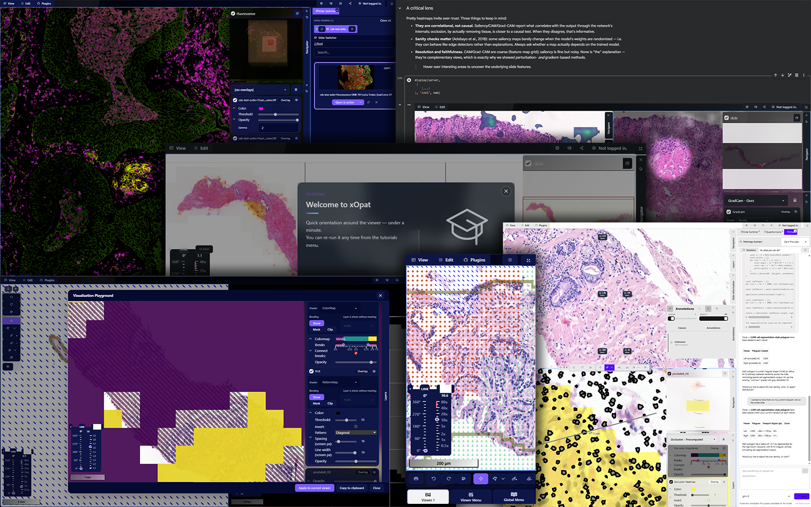

<h1 align="center">xOpat — Explainable Open Pathology Analysis Tool</h1>

  A web-based <b>whole-slide imaging framework</b> — not a viewer, but the viewer you configure to your use-case.

> ⚠️ **This is xOpat v3 — an alpha release.** The older but
> stable **v2** line lives on the [`archive/v2`](https://github.com/RationAI/xopat/tree/archive/v2)
> branch. If you experience anny issues, please, let us know.

## What is xOpat?

Whole-slide imaging produces massive, complex data — scans and derived outputs in
both **vector and raster** form — that are hard to work with efficiently. Patent
restrictions and competing standards have fragmented the landscape into many
ad-hoc open-source and proprietary tools. That diversity creates friction:
clinicians face legacy systems and economic constraints; researchers juggle
incompatible platforms and unwieldy data scales. And the **viewer** — the direct
interface to all of it — usually bakes in one platform's API, forcing
institution-wide, multi-petabyte decisions on the basis of viewer features that
are often orthogonal to actual viewing needs. The result is cascading lock-in
that can be impossible, or economically unjustifiable, to undo.

**xOpat takes a different stance: it is not a viewer, it is a viewing
framework.** Rather than hardwiring an API or a deployment model, it adapts
through **modules, plugins, and deep configuration flexibility** — letting you
assemble a tailored interface for clinical, research, or educational use without
committing your infrastructure to anyone's platform. The
[OpenSeadragon](https://openseadragon.github.io/) feature driver, 
and author of the [Flex Render](https://github.com/openseadragon/flex-render) renderer,
it is server-agnostic, modular, and extensible solution.

We run it across very different environments — closed-source infrastructures,
custom data backends, ad-hoc configurations, Jupyter Notebook & Google Colab
workflows, local desktop viewing, Kubernetes-scale deployments, and more.

## What it gives you

- 🔌 **No hardwired backend.** Connect to any WSI image server that speaks a
  protocol xOpat can resolve — add support for your own with a single file.
- 🗂️ **Vector *and* raster overlays.** Photoshop-style visualization layers
  (WebGL shaders) and versatile annotations over the same slide.
- 🧩 **Plugins & modules.** OIDC auth, AI chat assistants, visualization
  storytelling, tutorials, ICC profiles, action shortcuts, and more — load only
  what a deployment needs.
- ⚙️ **Static *and* runtime configuration.** Shape the whole experience from
  `env.json` down to per-session URLs.
- 🖥️ **Run it your way.** Node.js server, PHP server, or **server-less** —
  compiled once and served as static files.

## What xOpat is *not*

It is not an all-in-one product. xOpat does **not** read WSI formats itself and
does **not** run your AI — but it **connects** to the servers and services that
do. If an image server can read your slides, xOpat can show them; AI results
arrive as raster images (like any slide) or as vector graphics. 
Add a plugin to wire up whatever else you need.

## Get started

| You want to… | Go to |
| --- | --- |
| **Try it locally** in one command | [Quick Start](docs/web/quick_start.md) |
| **Host it for real** (Node / PHP / static) | [Deployment overview](docs/web/deployment.md) |
| **Configure a deployment** — secrets, proxy, IO | [Administration & Integration](INTEGRATION.md) |
| **Learn the terms** | [Glossary](docs/web/glossary.md) |
| **See what ships** | [Plugins](plugins/README.md) · [Modules](modules/README.md) |
| **Build a plugin or module** | [plugins/README.md](plugins/README.md) · [modules/README.md](modules/README.md) |
| **Understand the core** | [Core architecture](src/README.md) |

📚 **Full documentation:** <https://xopat.org> &nbsp;·&nbsp;
🔎 **API reference:** <https://xopat.org/api/>

## Sponsors

We are grateful for the development and financial contributions supporting xOpat
and the OpenSeadragon project.

